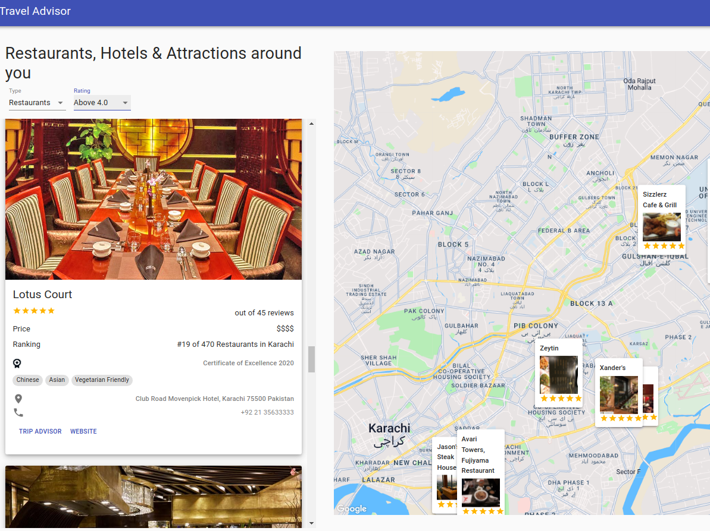

# 🗺️ Travel Companion Web Application

### _Travel companion app developed using React.js, RapidAPI, Material UI and Google Maps API_

### :link: https://travel-companion-web.netlify.app/

## Images

 

### Mobile

## Run Locally

- Run this command `git clone https://github.com/sosarenaint/Travel-Companion.git`
- You are now in the dev environment and you can play around
- Search Might not work because \*Billing details not set in GCP

## Technologies

- React.qjs
- RapidAPI
- Material-UI
- Google Maps API
